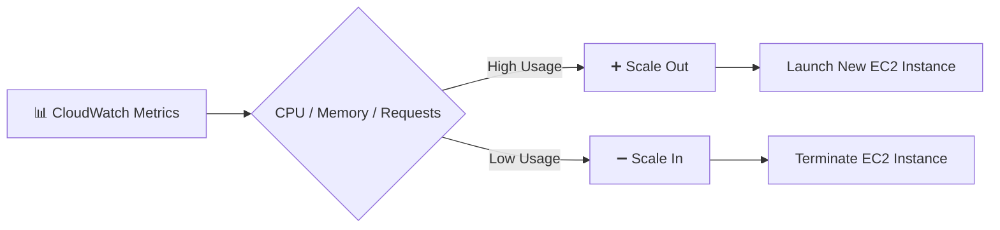
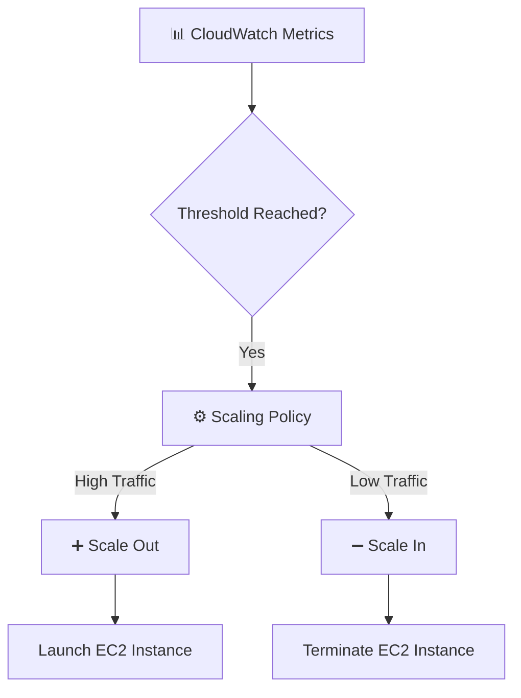

# 📈 Auto Scaling Group (ASG) Scaling Policies

### 📖 What are Scaling Policies?

**Scaling Policies** define **when** and **how** an **Auto Scaling Group (ASG)** should automatically **add (Scale Out)** or **remove (Scale In)** EC2 instances based on application demand.

### 💡 Simple Definition

> **Scaling Policies are rules that tell the Auto Scaling Group when to launch or terminate EC2 instances.**

---

# 🔄 How Scaling Policies Work



---

# 📚 Types of Scaling Policies

AWS supports **four main scaling policies**.

| Policy | Description | Best For |
|----------|-------------|----------|
| 🎯 Target Tracking Scaling | Maintains a target metric value (e.g., CPU at 50%). | Most applications |
| 📊 Step Scaling | Adds or removes instances based on metric thresholds. | Sudden traffic spikes |
| ⏰ Scheduled Scaling | Scales at a predefined date and time. | Predictable traffic |
| 🔮 Predictive Scaling | Uses historical data to predict future demand. | Recurring traffic patterns |

---

# 1️⃣ Target Tracking Scaling Policy

## What is it?

Target Tracking automatically adjusts the number of EC2 instances to maintain a specified metric value.

### Example

Target CPU Utilization = **50%**

- CPU > 50% → Add EC2 instances
- CPU < 50% → Remove EC2 instances

```text
Target CPU = 50%

CPU = 75%
     │
     ▼
Launch New EC2

CPU = 25%
     │
     ▼
Terminate EC2
```

### Advantages

- ✅ Easy to configure
- ✅ Automatically maintains the target value
- ✅ AWS-recommended scaling policy

---

# 2️⃣ Step Scaling Policy

## What is it?

Step Scaling increases or decreases the number of EC2 instances based on different metric ranges.

### Example

| CPU Utilization | Action |
|-----------------|--------|
| 60–70% | Add 1 EC2 |
| 70–85% | Add 2 EC2 |
| Above 85% | Add 3 EC2 |

```text
CPU = 68%
     │
     ▼
Add 1 EC2

CPU = 82%
     │
     ▼
Add 2 EC2

CPU = 90%
     │
     ▼
Add 3 EC2
```

### Advantages

- Better control over scaling
- Handles sudden traffic spikes
- More flexible than Target Tracking

---

# 3️⃣ Scheduled Scaling

## What is it?

Scheduled Scaling launches or terminates EC2 instances at a specific date and time.

### Example

| Time | Action |
|------|--------|
| 9:00 AM | Launch 5 EC2 Instances |
| 9:00 PM | Reduce to 2 EC2 Instances |

```text
09:00 AM
     │
     ▼
Launch Extra EC2

09:00 PM
     │
     ▼
Terminate Extra EC2
```

### Advantages

- Ideal for predictable workloads
- Reduces manual effort
- Saves infrastructure costs

---

# 4️⃣ Predictive Scaling

## What is it?

Predictive Scaling uses machine learning and historical CloudWatch data to forecast future demand and launch EC2 instances before traffic increases.

### Example

Every Friday evening:

- Historical data shows increased traffic.
- AWS launches additional EC2 instances before users arrive.

```text
Historical Traffic
        │
        ▼
AWS Predicts Future Load
        │
        ▼
Launch EC2 Before Traffic Increases
```

### Advantages

- Improves application performance
- Reduces response time
- Prevents delays during peak traffic

---

# 🔄 Scale Out vs Scale In

| Scale Out | Scale In |
|------------|----------|
| ➕ Adds EC2 instances | ➖ Removes EC2 instances |
| Handles high traffic | Saves costs during low traffic |
| Increases capacity | Decreases capacity |

---

# 🏗️ Scaling Policy Workflow


---

#


# 💡 Easy Memory Trick

| Policy | Remember As |
|---------|-------------|
| 🎯 Target Tracking | **Maintain a Target** 🎯 |
| 📊 Step Scaling | **Scale in Steps** 🪜 |
| ⏰ Scheduled Scaling | **Scale by Time** 🕒 |
| 🔮 Predictive Scaling | **Predict the Future** 🔮 |
