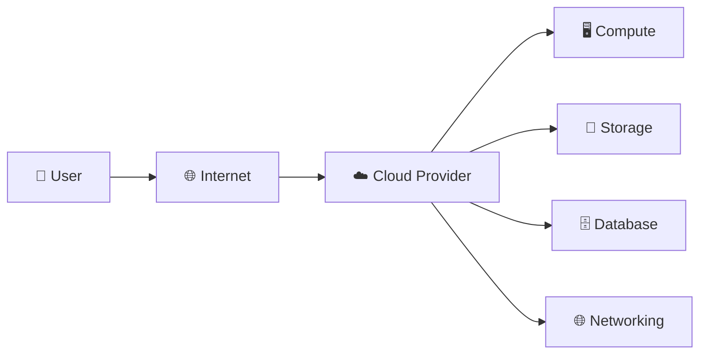

# ☁️ Fundamentals of Cloud Computing

Cloud computing is the foundation of modern IT. It allows individuals and organizations to access computing resources such as servers, storage, databases, networking, and software over the internet without owning physical infrastructure.

---

# 📖 What is Cloud Computing?

**Cloud Computing** is the delivery of computing services over the internet on a **pay-as-you-go** pricing model.

### 💡 Simple Definition

> **Cloud computing means renting IT resources (servers, storage, databases, networking, etc.) over the internet instead of buying and maintaining your own hardware.**

---

# 🏗️ How Cloud Computing Works



---

# ⭐ Characteristics of Cloud Computing

| Characteristic | Description |
|---------------|-------------|
| 🌐 **On-Demand Self-Service** | Users can provision resources whenever needed without human intervention. |
| 🌍 **Broad Network Access** | Services are accessible over the internet from anywhere. |
| 📦 **Resource Pooling** | Resources are shared among multiple customers securely. |
| 📈 **Rapid Elasticity** | Resources can quickly scale up or down based on demand. |
| 💳 **Measured Service** | Pay only for the resources you use. |

---

# 🎯 Benefits of Cloud Computing

- 💰 Cost Savings
- 📈 Scalability
- ⚡ Elasticity
- 🌍 Global Access
- 🔒 Security
- 🚀 High Performance
- 🛡️ High Availability
- 🔄 Disaster Recovery
- 🤝 Easy Collaboration

---

# ☁️ Cloud Deployment Models

| Deployment Model | Description |
|------------------|-------------|
| 🌍 **Public Cloud** | Cloud services shared over the internet (e.g., AWS, Azure, GCP). |
| 🏢 **Private Cloud** | Dedicated cloud infrastructure for one organization. |
| 🔀 **Hybrid Cloud** | Combination of public and private cloud environments. |
| 👥 **Community Cloud** | Shared by organizations with common requirements. |

---

# 🛠️ Cloud Service Models

| Model | Provider Manages | Customer Manages | Example |
|--------|------------------|------------------|---------|
| **IaaS** | Infrastructure | OS, Applications, Data | Amazon EC2 |
| **PaaS** | Infrastructure + OS | Applications & Data | AWS Elastic Beanstalk |
| **SaaS** | Everything | Only uses the software | Gmail, Microsoft 365 |

---

# 🧱 Core Components of Cloud Computing

| Component | Purpose |
|-----------|---------|
| 🖥️ Compute | Runs applications and workloads. |
| 💾 Storage | Stores files, backups, and objects. |
| 🗄️ Database | Stores structured and unstructured data. |
| 🌐 Networking | Connects resources securely. |
| 🔐 Security | Protects cloud resources and data. |
| 📊 Monitoring | Tracks resource health and performance. |

---

# 📚 Key Cloud Concepts

| Concept | Description |
|---------|-------------|
| 🖥️ **Virtualization** | Running multiple virtual machines on one physical server. |
| 📈 **Scalability** | Increase or decrease resources to handle workload changes. |
| ⚡ **Elasticity** | Automatically adjusts resources based on demand. |
| 💳 **Pay-as-you-go** | Pay only for the services you consume. |
| 👥 **Multi-Tenancy** | Multiple customers securely share cloud infrastructure. |
| 🌍 **Availability Zones (AZs)** | Isolated data centers within a region for fault tolerance. |
| 🌎 **Region** | A geographical area containing one or more Availability Zones. |

---

# 🔄 Basic Cloud Architecture

```text
User
   │
   ▼
Internet
   │
   ▼
Cloud Provider (AWS / Azure / GCP)
   │
   ├── Compute
   ├── Storage
   ├── Database
   ├── Networking
   └── Security
```

---


# 🎯 Advantages vs Disadvantages

| Advantages | Disadvantages |
|------------|---------------|
| Lower Cost 💰 | Internet Dependency 🌐 |
| Easy Scalability 📈 | Vendor Lock-in 🔒 |
| High Availability 🛡️ | Limited Control ⚙️ |
| Global Access 🌍 | Compliance Challenges 📋 |
| Automatic Updates 🔄 | Downtime Risk ⚠️ |

---


