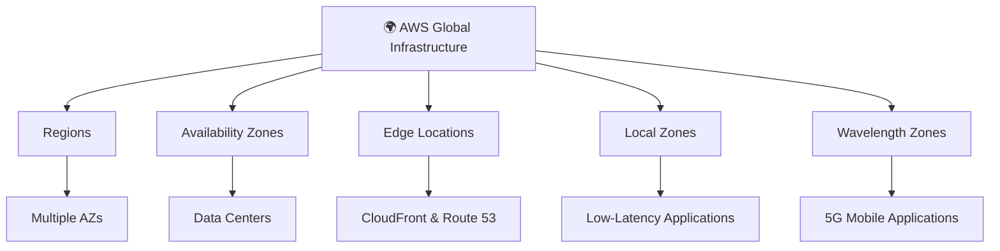

# 🌍 AWS Global Infrastructure

## 📖 Introduction

AWS Global Infrastructure is the worldwide network of **data centers, Regions, Availability Zones (AZs), Edge Locations, and Local Zones** that enables AWS to deliver secure, reliable, scalable, and high-performance cloud services.

---

## 🏗️ AWS Global Infrastructure Components

---

## 🌎 AWS Regions

### 📖 Definition

An **AWS Region** is a **geographical area** where AWS has multiple data centers.

Each Region is **completely independent** from other Regions.

---

## 🏢 Availability Zones (AZs)

### 📖 Definition

An **Availability Zone (AZ)** is one or more physically separate data centers within an AWS Region.

Each AZ has:
- Independent power
- Independent cooling
- Independent networking

---

## 🏙️ Local Zones

### 📖 Definition

AWS Local Zones extend AWS infrastructure closer to large metropolitan areas.

They are designed for workloads requiring **single-digit millisecond latency**.

---

## 📶 Wavelength Zones

### 📖 Definition

AWS Wavelength Zones bring AWS services into **5G networks**.

They enable applications that require ultra-low latency.

---

## 🏢 AWS Data Centers

AWS Data Centers are secure facilities that contain:

- Physical servers
- Storage devices
- Networking equipment
- Cooling systems
- Power supplies

Each Availability Zone contains one or more data centers.

---
## 🌐 AWS Edge Locations, CDN, and PoP (Point of Presence)

### 📖 Introduction

When users access a website, they expect it to load quickly. AWS uses **CDN**, **Edge Locations**, and **PoPs** to deliver content faster by bringing it closer to users.

---

## 🌐 What is a CDN (Content Delivery Network)?

### 📖 Definition

A **CDN (Content Delivery Network)** is a network of servers located in different parts of the world.

It stores copies (cache) of website content such as images, videos, CSS, and JavaScript files closer to users.

Instead of downloading content from the main server every time, users get it from the nearest server.

> **AWS CDN Service:** **Amazon CloudFront**

## 🌍 What is an Edge Location?

### 📖 Definition

An **Edge Location** is a small AWS location where CloudFront stores (caches) copies of your website content.

It is located closer to users than an AWS Region.

When a user requests content, AWS first checks the nearest Edge Location.

If the content is available, it is delivered immediately.

## 📍 What is a PoP (Point of Presence)?

### 📖 Definition

A **PoP (Point of Presence)** is an AWS network location.

Each PoP contains one or more **Edge Locations**.

## 🔄 How It Works

### Step 1

👤 A user opens a website.

⬇️

### Step 2

AWS sends the request to the **nearest PoP (Edge Location)**.

⬇️

### Step 3

If the content is already stored there (**Cache Hit**),

✅ The user receives it immediately.

⬇️

### Step 4

If the content is not stored (**Cache Miss**),

- Edge Location requests it from the **AWS Region (Origin Server)**.
- Stores a copy in its cache.
- Sends the content to the user.

The next user gets the content directly from the Edge Location.

---
