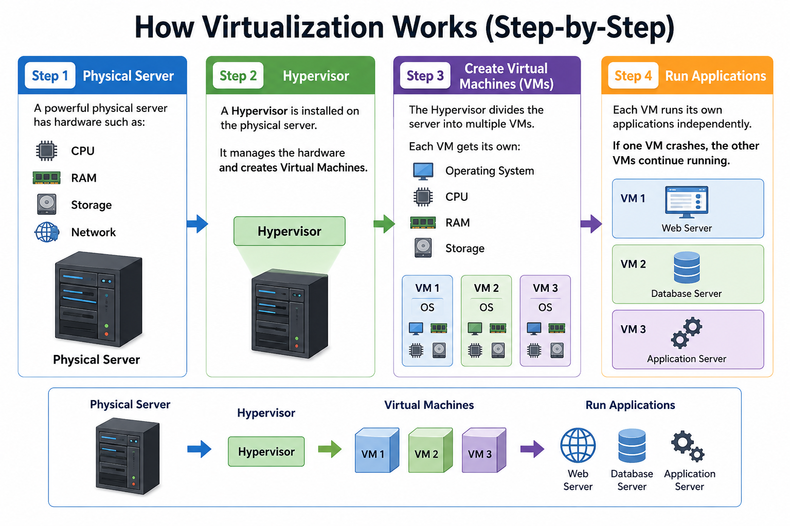

# 💻 Virtualization in AWS

## 📖 What is Virtualization?

**Virtualization** is the technology of creating **virtual (software-based) versions** of computers, servers, storage, or networks on a single physical machine.

In simple words:

> **Virtualization in AWS is the process of creating multiple Virtual Machines (VMs) on a single physical server.**

---
## 🔄 How Virtualization Works (Step-by-Step)
<p align="center">
  
</p>

# 🏗️ AWS Virtualization Architecture (Proper Sequence)

### 1️⃣ AWS Data Center

An **AWS Data Center** is a secure facility that contains networking equipment, storage devices, and multiple server racks.

⬇️

### 2️⃣ Rack

A **Rack** is a cabinet that holds multiple physical servers.

```text
🏢 AWS Data Center
        │
        ▼
   ┌───────────┐
   │   Rack    │
   ├───────────┤
   │ Server 1  │
   │ Server 2  │
   │ Server 3  │
   └───────────┘
```

⬇️

### 3️⃣ Physical Server

Each rack contains several **Physical Servers**.

A Physical Server provides hardware resources such as:

```text
🖥️ Physical Server
────────────────────
CPU
RAM
Storage
Network
```

⬇️

### 4️⃣ Hypervisor

A **Hypervisor** is installed on the Physical Server.

It creates and manages multiple **Virtual Machines (VMs)** by sharing the server's hardware resources.

```text
🖥️ Physical Server
        │
        ▼
⚙️ Hypervisor
```

⬇️

### 5️⃣ Virtual Machines (VMs)

The Hypervisor divides the Physical Server into multiple **Virtual Machines (VMs)**.

Each VM has its own:

- Operating System
- CPU
- RAM
- Storage

```text
        ⚙️ Hypervisor
      ┌────┼────┬────┐
      ▼    ▼    ▼
   💻 VM1 💻 VM2 💻 VM3
   Windows  Linux   Ubuntu
```

⬇️

### 6️⃣ Applications

Each Virtual Machine runs its own applications independently.

```text
💻 VM1 → 🌐 Web Server

💻 VM2 → 🗄️ Database Server

💻 VM3 → ⚙️ Application Server
```

---

### ⭐ Easy Formula

```text
AWS Data Center
        ↓
      Rack
        ↓
Physical Server
        ↓
   Hypervisor
        ↓
Virtual Machines (VMs)
        ↓
Applications
```
